#HSLIDE

## Monolith to reactive

*It's all about architecture*

James Roper

`@jroper`

Lightbend

#HSLIDE

## Agenda

- Identify pitfalls of monolith conversions     <!-- .element: class="fragment" -->
- Architect reactive solutions                  <!-- .element: class="fragment" -->
- See Lagom in action                           <!-- .element: class="fragment" -->
- Live coding!                                  <!-- .element: class="fragment" -->

#HSLIDE

## Lagom Auction

- ebay clone                                    <!-- .element: class="fragment" -->
- Was a monolith, converted to microservices    <!-- .element: class="fragment" -->
- Will one day overtake ebay!                   <!-- .element: class="fragment" -->

#VSLIDE

    

    

    

    

    

    

    

    

    

    

    

    

#HSLIDE

## What if something goes wrong?

- Microservices means more moving parts     <!-- .element: class="fragment" -->
    - More chance for failure               <!-- .element: class="fragment" -->
    - More chance for inconsistency         <!-- .element: class="fragment" -->

#VSLIDE

## Synchronous communication

**synchronous** *adj.* - existing or occurring at the same time.

#VSLIDE

## Synchronous communication

- Typically request/response                        <!-- .element: class="fragment" -->
    - e.g. REST                                     <!-- .element: class="fragment" -->
- Both systems must be responsive at the same time  <!-- .element: class="fragment" -->

#VSLIDE

    

    

    

    

    

    

    

    

#HSLIDE

## Pattern 1: Circuit breakers

- A gate that opens in the event of failure     <!-- .element: class="fragment" -->
    - Including timeouts                        <!-- .element: class="fragment" -->
- Protects already failing services             <!-- .element: class="fragment" -->
- Allows fail fast handling                     <!-- .element: class="fragment" -->

#VSLIDE

    

    

    

    

    

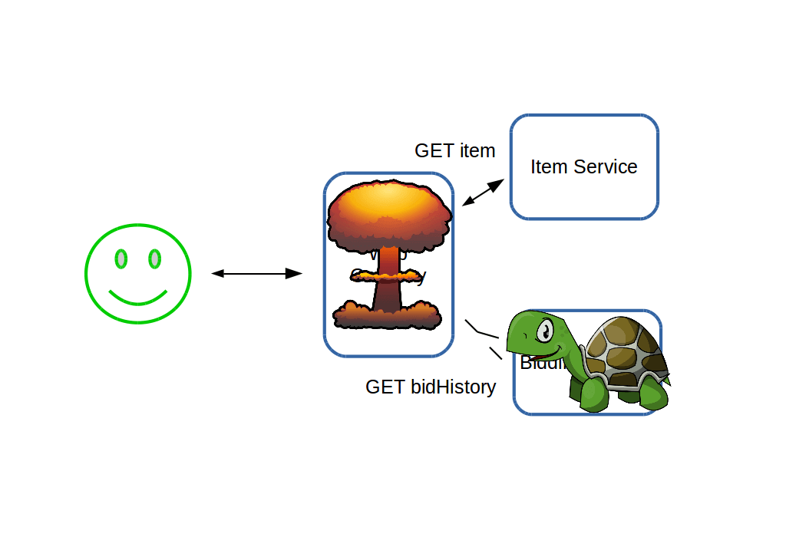
    

    

    

#HSLIDE

## Pattern 2: Failure recovery

- Work around failure by degrading                  <!-- .element: class="fragment" -->
- Not every call is necessary to render every page  <!-- .element: class="fragment" -->

#VSLIDE

    

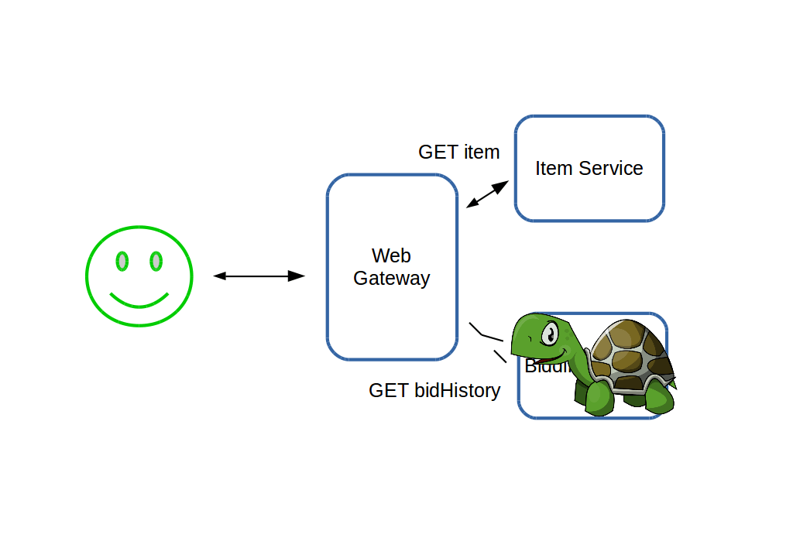
    

    

    

#HSLIDE

## Failure can lead to inconsistency

#VSLIDE

    

    

    

    

    

    

    

    

    

    

    

    

    

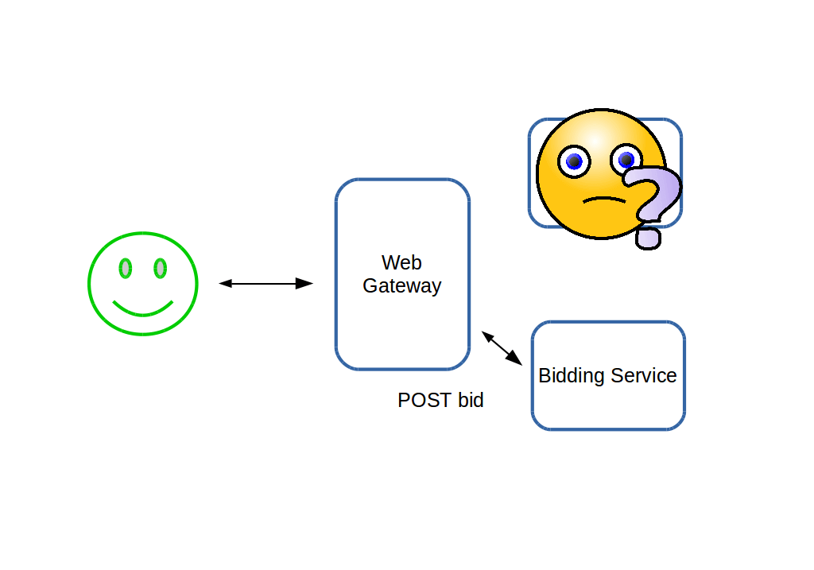
    

    

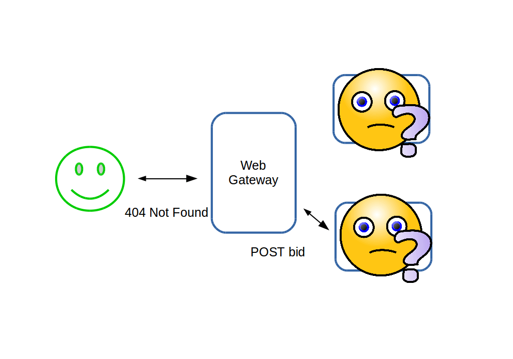
    

    

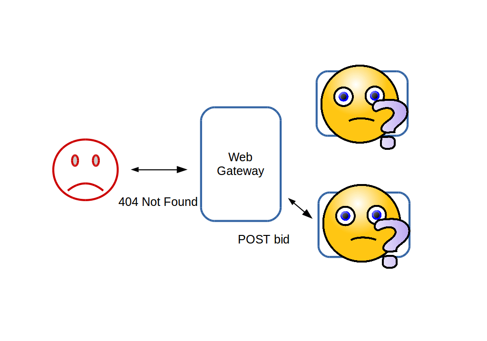
    

#VSLIDE

## Inconsistency from failure

- Synchronous "at same time" communication of updates is dangerous  <!-- .element: class="fragment" -->
    - Transactions can't span service boundaries                    <!-- .element: class="fragment" -->

#HSLIDE

## Pattern 3: Asynchronous messaging

- Does not require both systems to be responsive    <!-- .element: class="fragment" -->
- Perfect if you already persist events             <!-- .element: class="fragment" -->
- Use persistent events as a source of messages     <!-- .element: class="fragment" -->

#VSLIDE

    

    

    

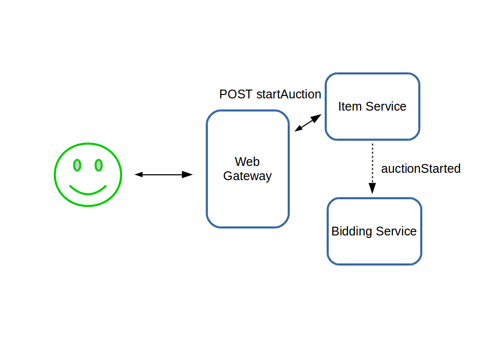
    

    

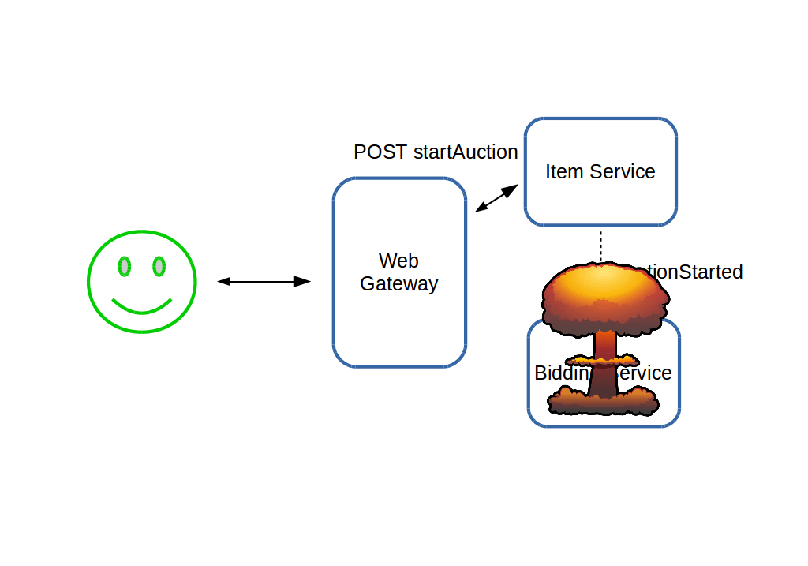
    

    

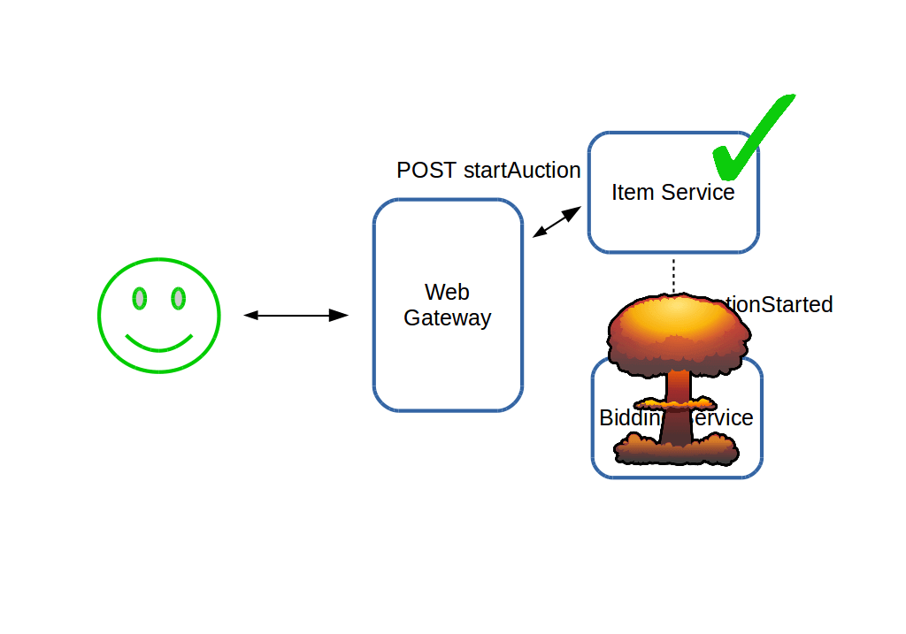
    

    

    

#HSLIDE

## Unacceptable degradation

- Earlier we degraded the item page with empty bid history  <!-- .element: class="fragment" -->
- Price was also $0                                         <!-- .element: class="fragment" -->
- Users may tolerate no history, but not wrong price        <!-- .element: class="fragment" -->

#VSLIDE

    

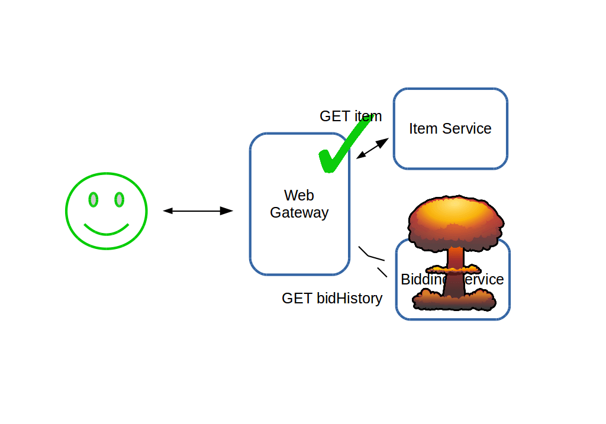
    

    

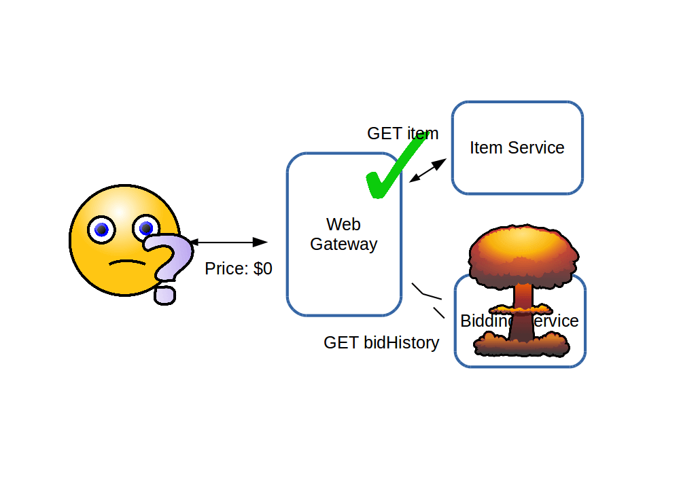
    

#HSLIDE

## Pattern 4: Denormalize

- Push important information to other services      <!-- .element: class="fragment" -->
    - Important for system funcitons                <!-- .element: class="fragment" -->
    - Important for business functions              <!-- .element: class="fragment" -->
- Store duplicated information in those services    <!-- .element: class="fragment" -->
    - AKA denormalization                           <!-- .element: class="fragment" -->

#VSLIDE

    

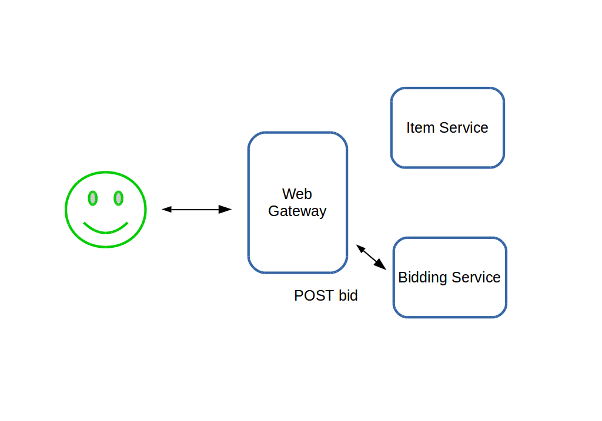
    

    

    

    

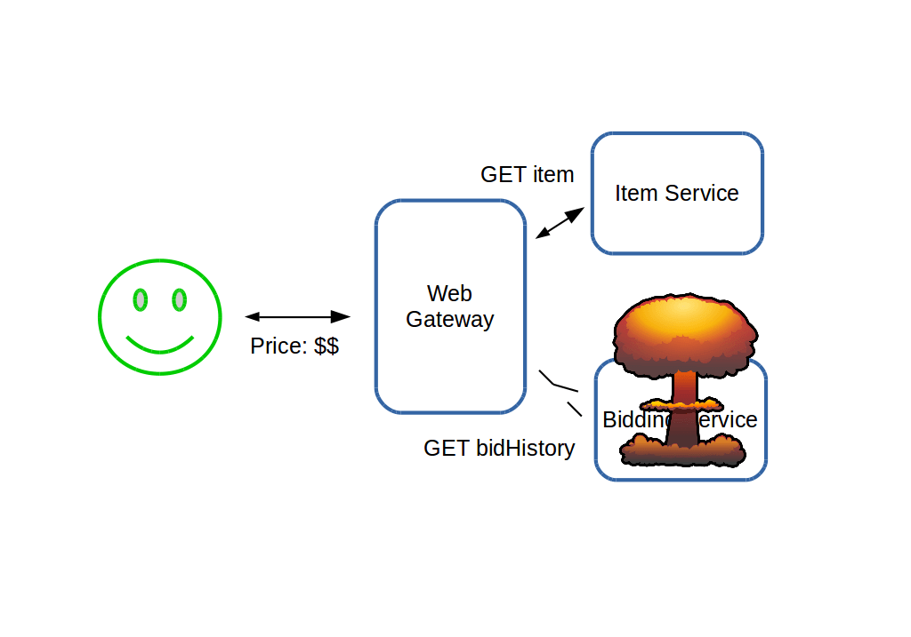
    

#HSLIDE

## Summary

- Monolith to microservices requires rearchitecting data flows  <!-- .element: class="fragment" -->
- Failure and inconsistency must be managed                     <!-- .element: class="fragment" -->
- Use:                                                          <!-- .element: class="fragment" -->
    - Circuit breakers                                          <!-- .element: class="fragment" -->
    - Failure degradation                                       <!-- .element: class="fragment" -->
    - Asynchronous messaging                                    <!-- .element: class="fragment" -->
    - Denormalization                                           <!-- .element: class="fragment" -->

#VSLIDE

## Next steps

http://lagomframework.com
https://github.com/jroper/mircoservices-architecture

