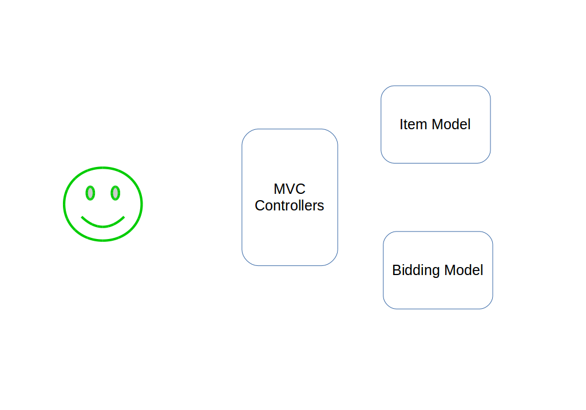

#HSLIDE

## Monolith to reactive

*It's all about architecture*

James Roper

`@jroper`

Lightbend

#HSLIDE

## Agenda

- Identify pitfalls of monolith conversions     <!-- .element: class="fragment" -->
- Architect reactive solutions                  <!-- .element: class="fragment" -->
- See Lagom in action                           <!-- .element: class="fragment" -->
- Live coding!                                  <!-- .element: class="fragment" -->

#HSLIDE

## Lagom auction

- Ebay clone                                    <!-- .element: class="fragment" -->
- Was a monolith, converted to microservices    <!-- .element: class="fragment" -->
- Will one day overtake Ebay                    <!-- .element: class="fragment" -->

#VSLIDE

## Monolith architecture

    

    

    

    

    

    

    

    

    

    

    

    

#HSLIDE

## What if something goes wrong?

#VSLIDE

## Synchronous communication

#VSLIDE

### synchronous *adjective* - existing or occurring at the same time.

#VSLIDE

## Synchronous communication

- Typically request/response                    <!-- .element: class="fragment" -->
    - e.g. REST                                 <!-- .element: class="fragment" -->
- Both systems must responsive at the same time <!-- .element: class="fragment" -->

#VSLIDE

    

    

    

    

    

    

#HSLIDE

## Pattern 1: Circuit breakers

- A gate that opens in the event of failure     <!-- .element: class="fragment" -->
    - Including timeouts                        <!-- .element: class="fragment" -->
- Protects already failing services             <!-- .element: class="fragment" -->
- Allows fail fast handling                     <!-- .element: class="fragment" -->

#VSLIDE

    

    

    

    

    

    

