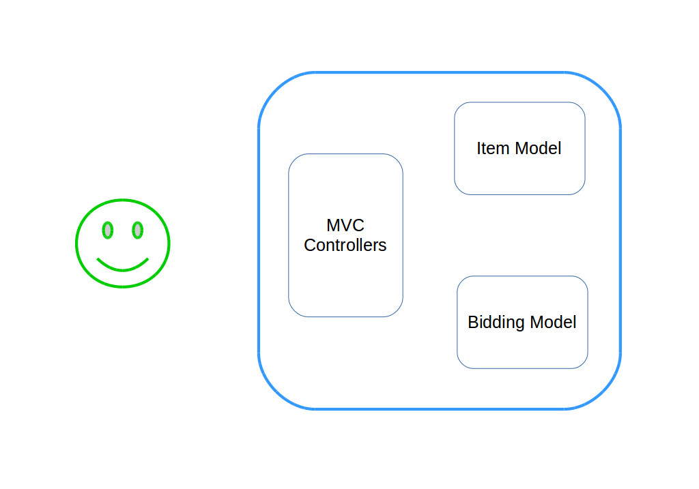
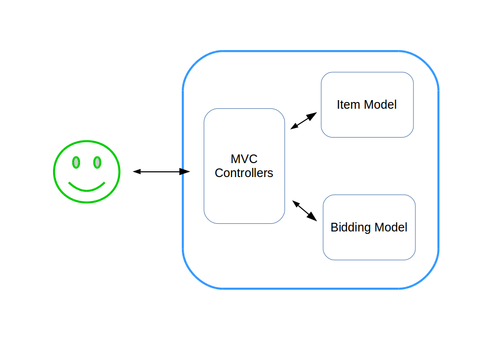
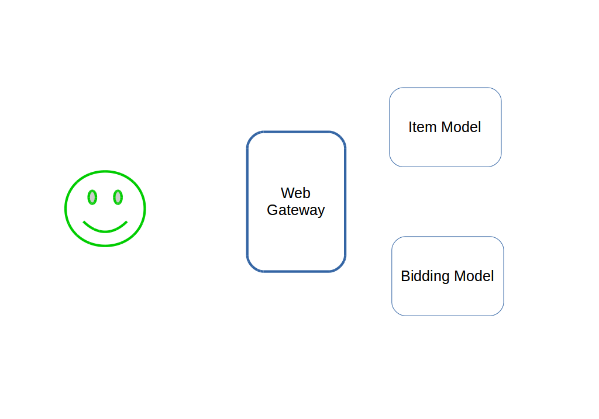
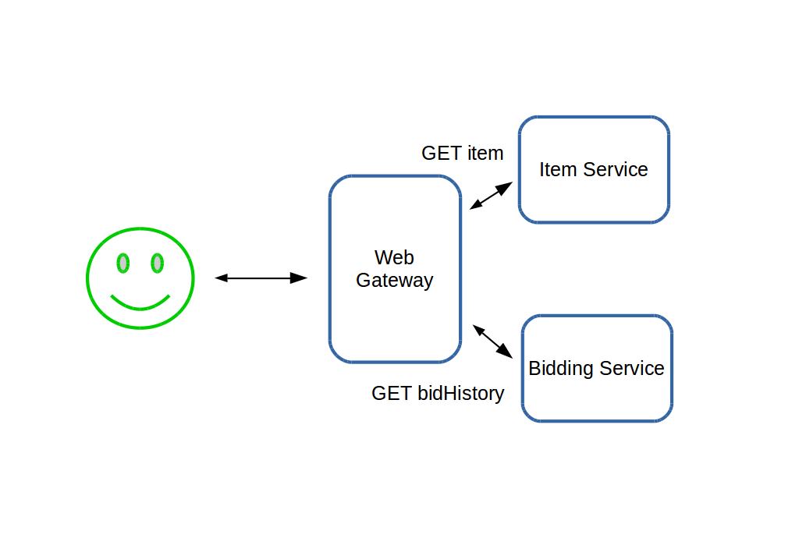

#HSLIDE

## Monolith to reactive

*It's all about architecture*

James Roper

`@jroper`

Lightbend

#HSLIDE

## Agenda

- Identify pitfalls of monolith conversions     <!-- .element: class="fragment" -->
- Architect reactive solutions                  <!-- .element: class="fragment" -->
- See Lagom in action                           <!-- .element: class="fragment" -->
- Live coding!                                  <!-- .element: class="fragment" -->

#HSLIDE

## Lagom auction

- Ebay clone                                    <!-- .element: class="fragment" -->
- Was a monolith, converted to microservices    <!-- .element: class="fragment" -->
- Will one day overtake Ebay                    <!-- .element: class="fragment" -->

#VSLIDE

## Monolith architecture

    

    

    

    

    

    

    

    

    

    

    

    

    

    

